
- SAP BTP is the unified cloud platform for extending, integrating, analyzing, automating, and adding AI to SAP products like S/4HANA.
- The core consists of five functional pillars (App Dev, Automation, Integration, Data & Analytics, AI) plus shared foundation and operational knowledge.
- The right question is not "Should we adopt BTP?" but "Which BTP service, for which responsibility?"


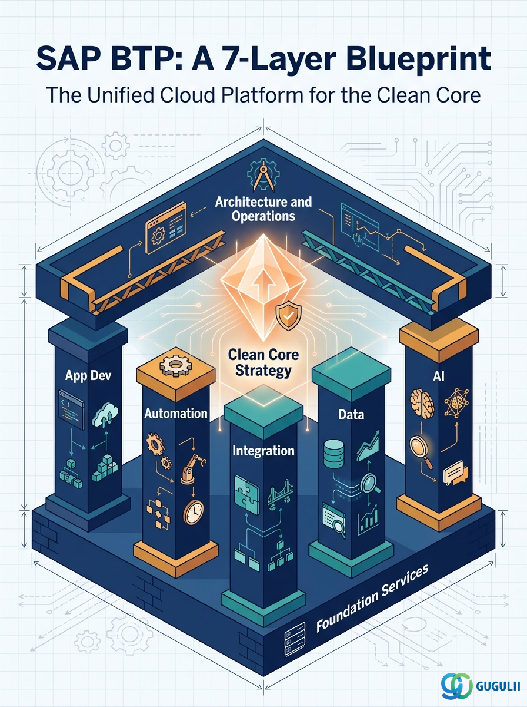

## 1. Target Readers

| Reader | What You Will Get |
|---|---|
| Executives & DX Leaders | A 3-line takeaway on what BTP delivers and why it matters now |
| Enterprise IT Leads | BTP's functional categories and typical use cases |
| SAP Consultants & Engineers | Help Portal-aligned overview with links to each official service page |

Each section is tagged with **🎯 [Audience]**. Skip to what is relevant for you.

---

## 2. Where This Article Sits in the Big Picture

BTP can be organized in 7 layers. This article covers the **Big Picture (📍)**.

The Domain column below is numbered to match the section structure of this article — when you see `5-1. Application Development`, that section drills into Layer 1.

| Layer Type | Domain | Key Services | This Article |
|---|---|---|---|
| Functional | **5-1. Application Development** | Build Apps / BAS / Cloud Foundry / Kyma / ABAP | — |
| Functional | **5-2. Automation** | Build Process Automation / Task Center | — |
| Functional | **5-3. Integration** | Integration Suite / Event Mesh / API Mgmt | — |
| Functional | **5-4. Data and Analytics** | HANA Cloud / Datasphere / SAC / MDG | — |
| Functional | **5-5. AI** | AI Core / Joule / GenAI Hub | — |
| Foundation | **5-6. Foundation Services** | IAS / IPS / XSUAA / Cloud Connector | — |
| Cross-cutting | **Big Picture / Architecture & Ops / Use Cases** | Landscape / CI-CD / Security / Use Cases | 📍 |

Each service is detailed in dedicated articles (see "What to Read Next" at the end).

---

## 3. What is SAP BTP?

🎯 **For: All readers**

SAP Business Technology Platform (BTP) is SAP's **unified cloud-based technology platform**.

In one sentence: it is **the foundation for extending, integrating, analyzing, automating, and adding AI capabilities to SAP products in the cloud**.

| Aspect | Description |
|---|---|
| Delivery model | Cloud service (mix of PaaS and SaaS) |
| Provider | SAP, running on hyperscaler infrastructure (AWS / Azure / GCP) |
| Primary use | Extending SAP products like S/4HANA, system integration, analytics, AI, automation |
| Official docs | [SAP Help Portal: SAP Business Technology Platform](https://help.sap.com/docs/btp/sap-business-technology-platform/sap-business-technology-platform) |

> ⚠️ **A common misconception**
> "Should we adopt BTP?" is the wrong question. BTP is an umbrella for many services. The right question is: "Which BTP service, for which purpose?"

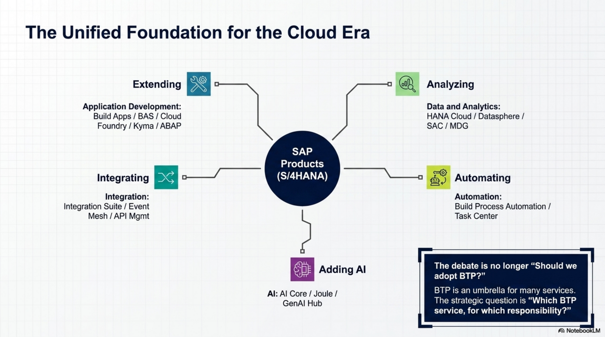

---

## 4. Why BTP Matters Now: The Clean Core Strategy

🎯 **For: Executives & DX Leaders**

SAP has been pushing the **Clean Core** strategy hard in recent years. This is the core reason BTP exists.

| Traditional SAP | Clean Core Approach |
|---|---|
| Customize ERP core to match business needs | Keep ERP core standard, build extensions outside (on BTP) |
| Every upgrade requires regression testing of all add-ons | Core stays unaffected; upgrades become lightweight |
| Customizations turn into technical debt | Extensions are isolated and easier to maintain |

S/4HANA's release cycle is shorter than the legacy ERP's, making **"how to meet business requirements without modifying the core"** a board-level concern. BTP is the answer SAP provides.

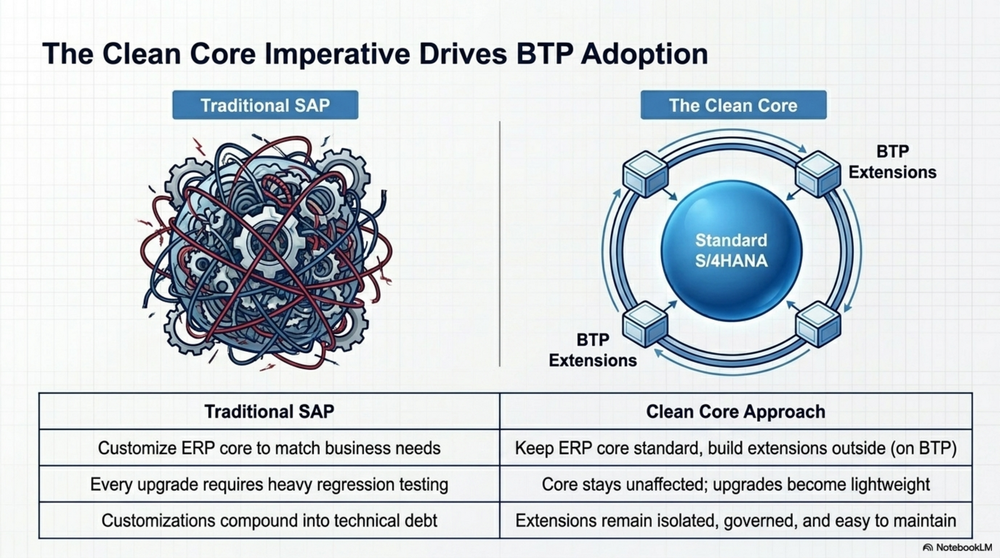

> 📖 **Learn more**: [Clean Core Extensibility — SAP Help Portal](https://help.sap.com/docs/btp/btp-developers-guide/clean-core-extensibility)

---

## 5. The 7 Layers of SAP BTP

🎯 **For: IT Leads & Consultants**

Aligned with SAP Help Portal, BTP can be understood through these 7 layers. Layers 1 to 5 are SAP's official "five pillars"; layers 6 and 7 are essential surrounding domains in actual practice.

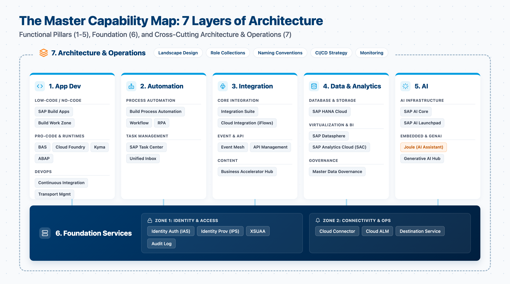

### 5-1. Application Development

The domain for building SAP and custom applications.

| Sub-domain | Key Services | Role |
|---|---|---|
| Low-Code/No-Code | SAP Build Apps / Build Work Zone | Citizen development for business users |
| Pro-Code | Business Application Studio / Mobile Services | IDE for professional developers |
| Runtimes | Cloud Foundry / Kyma / ABAP | Application execution environments |
| DevOps | Continuous Integration / Cloud Transport Mgmt | CI/CD and transport management |

> 📖 **Learn more**: [Application Development — SAP Help Portal](https://help.sap.com/docs/btp/sap-business-technology-platform/development)

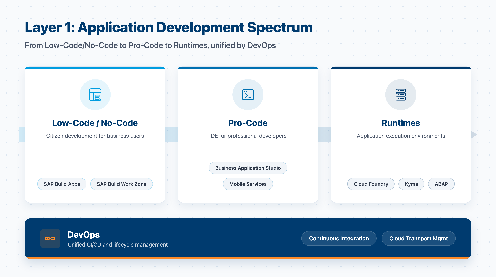

### 5-2. Automation

The domain for automating business processes.

| Key Services | Role |
|---|---|
| SAP Build Process Automation | Workflow, RPA, decisions, process visibility |
| SAP Task Center | Unified inbox for approval tasks across SAP products |

> 📖 **Learn more**: [SAP Build Process Automation — SAP Help Portal](https://help.sap.com/docs/build-process-automation)

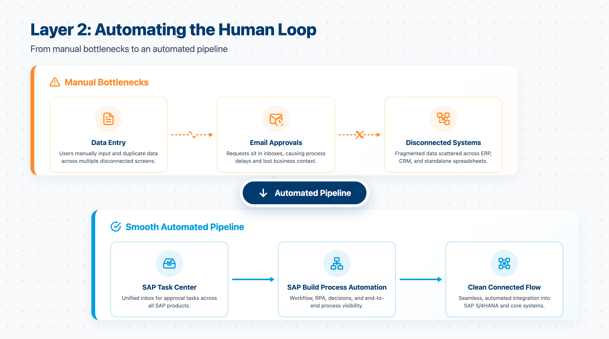

### 5-3. Integration

The domain for connecting SAP and external systems (SaaS, on-premise, custom apps).

| Key Services | Role |
|---|---|
| SAP Integration Suite | Full iPaaS: iFlow, API, Event, Open Connectors |
| SAP Business Accelerator Hub | Catalog of pre-built integration content and APIs |

The Integration Suite ships with over 3,400 pre-built iFlows and 170+ third-party connectors, removing the need to build integrations from scratch.

> 📖 **Learn more**: [Integration Suite — SAP Help Portal](https://help.sap.com/docs/integration-suite)

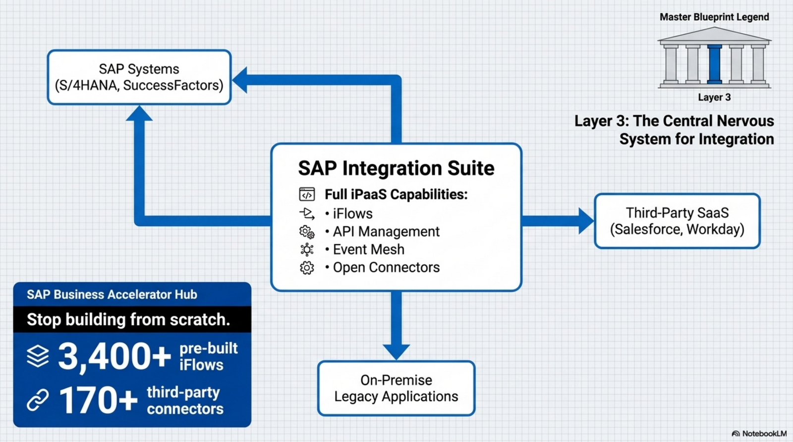

### 5-4. Data and Analytics

The domain for data management, analytics, and planning.

| Key Services | Role |
|---|---|
| SAP HANA Cloud | In-memory database, the data backbone of BTP |
| SAP Datasphere | Data virtualization and integration (formerly Data Warehouse Cloud) |
| SAP Analytics Cloud (SAC) | Analytics, planning, and predictive (BI) |
| SAP Master Data Governance | Master data management |

> 📖 **Learn more**: [Data and Analytics — SAP Help Portal](https://help.sap.com/docs/btp/sap-business-technology-platform/data-and-analytics)

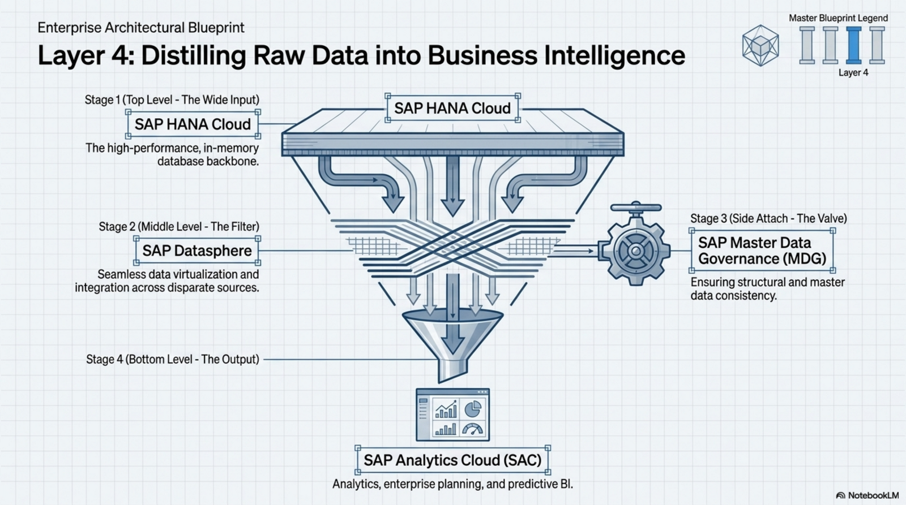

### 5-5. AI

The domain for embedding AI into SAP business processes.

| Key Services | Role |
|---|---|
| SAP AI Core | AI infrastructure (model training and inference) |
| SAP AI Launchpad | Operational UI for AI |
| Joule | SAP's AI assistant, embedded across SAP products |
| Generative AI Hub | Unified access to LLMs (GPT, Claude, Gemini, etc.) |

As of 2026, Joule is integrated into S/4HANA, SuccessFactors, Ariba, and other major SAP products, enabling conversational interactions with business processes.

> 📖 **Learn more**: [Business AI — SAP Help Portal](https://help.sap.com/docs/sap-ai-core)

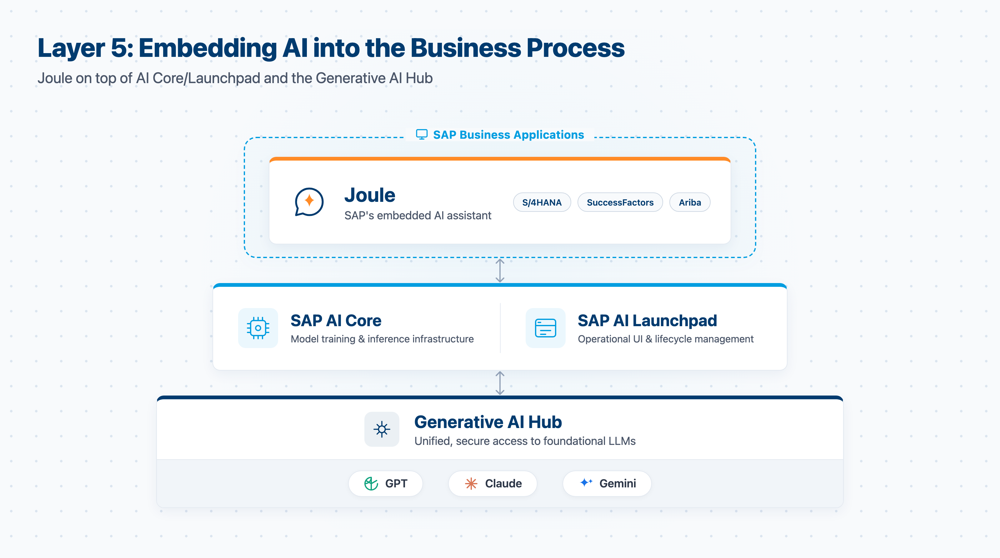

### 5-6. Foundation Services

🎯 **For: Infrastructure & Security Teams**

The shared foundation supporting layers 1 through 5.

| Key Services | Role |
|---|---|
| Identity Authentication Service (IAS) | Authentication (SSO, MFA) |
| Identity Provisioning Service (IPS) | Identity federation and provisioning |
| XSUAA | Authorization and token issuance |
| Cloud Connector | Secure connection to on-premise SAP systems |
| Cloud ALM | Application lifecycle management |
| Audit Log | Audit logging |

> 📖 **Learn more**: [Security — SAP Help Portal](https://help.sap.com/docs/btp/sap-business-technology-platform/security)

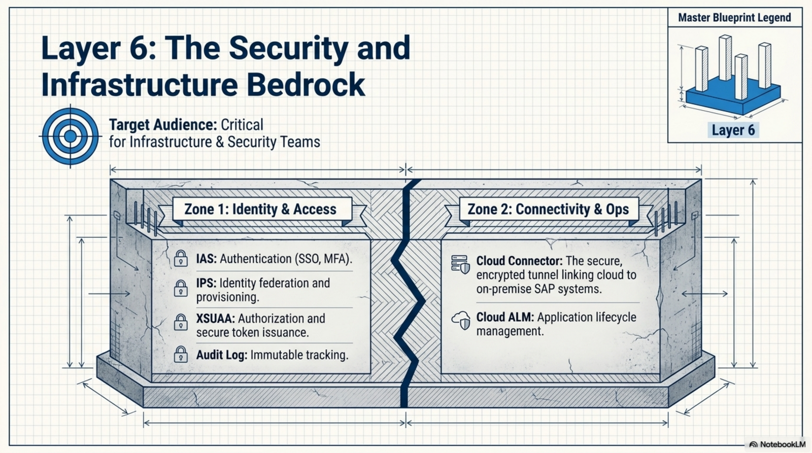

### 5-7. Architecture & Operations Knowledge

🎯 **For: Architects & Operations Teams**

The know-how needed to combine the above services into a working solution.

| Topic | Key Considerations |
|---|---|
| Landscape Design | Global account / subaccount structure |
| Role Collection Design | Authorization design |
| Naming Convention | Naming rules across the landscape |
| CI/CD Strategy | Transport and deployment strategy |
| Monitoring Strategy | Monitoring and alerting design |

These are scattered across SAP's official documentation, which is why this site organizes them as a dedicated series.

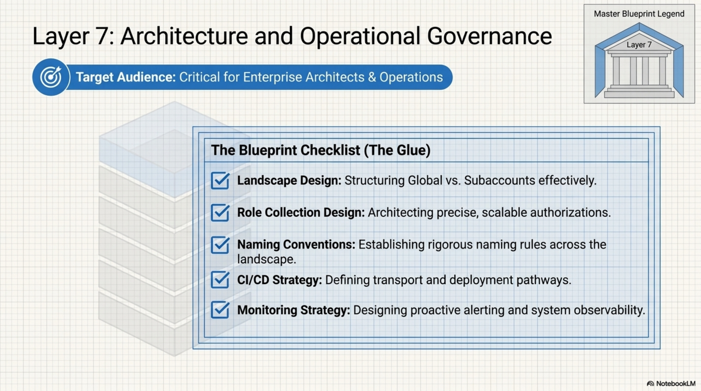

---

## 6. Licensing Models and Getting Started

🎯 **For: Executives & Procurement**

BTP offers several contract models. The right one depends on **when, who, and how much** you plan to use.

| Model | Overview | Best For |
|---|---|---|
| **CPEA** (Cloud Platform Enterprise Agreement) | Annual prepaid commitment, drawn down by service usage | Mid to large rollouts with predictable usage |
| **BTPEA** (BTP Enterprise Agreement) | CPEA's successor, recommended by SAP | Default choice for new contracts |
| **Subscription** | Annual contract per service | Stable usage of specific services |
| **Pay-As-You-Go (PAYG)** | Pure consumption-based billing | PoCs, evaluation, short-term work (priced higher per unit) |

> 💡 **Want to try BTP for free?**
> [SAP BTP Free Tier](https://www.sap.com/products/technology-platform/trial.html) gives you free access to selected services.
> [SAP BTP Trial](https://account.hanatrial.ondemand.com/) offers a time-limited evaluation environment.

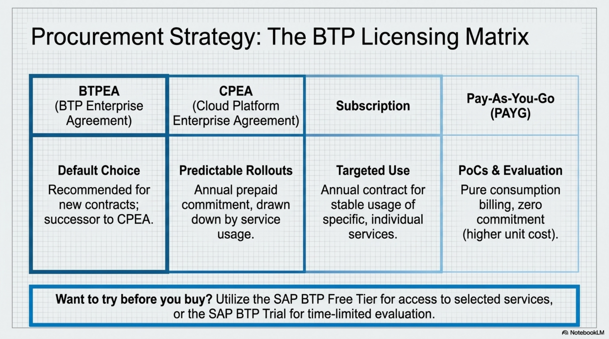

---

## 7. Common Misconceptions

🎯 **For: All readers**

| Misconception | Reality |
|---|---|
| "Using BTP equals Clean Core" | Using BTP does not automatically mean Clean Core. In-app extensions can also be Clean Core compliant. |
| "BTP is just a middleware between SAP systems" | It is more than middleware. It carries business responsibility, authorization, and governance. |
| "Should we adopt BTP?" | The unit of debate is too large. Reframe as: "Which service, for which purpose?" |
| "BTP licenses are too expensive" | Pricing varies per service. Cost discussions without a usage scenario are not actionable. |

These misconceptions surface in real projects all the time. Each is addressed in dedicated articles in this series.

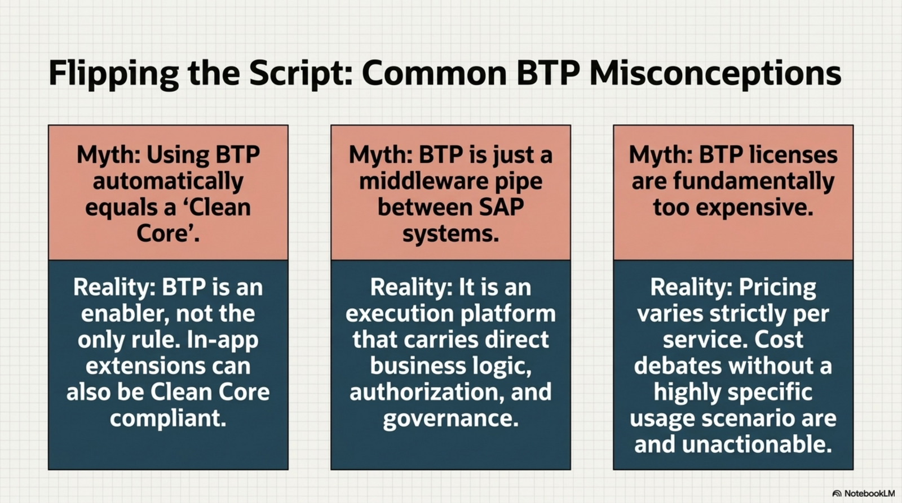

---

## 8. What to Read Next

This site organizes BTP knowledge into the following structure:

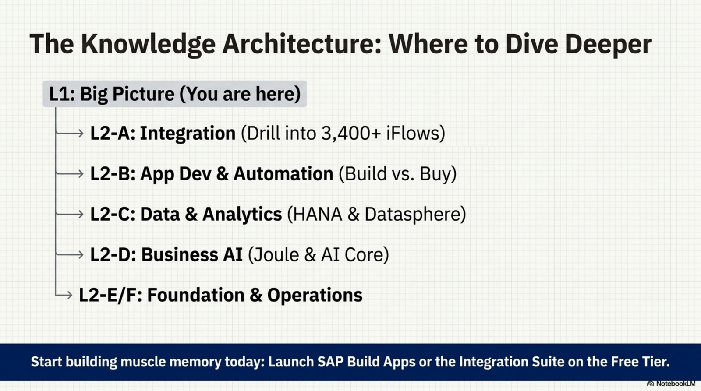

| L1. Big Picture | L2. Functional Domains |
|---|---|
| **BTP-001 What is BTP** (this article) | L2-A. Integration |
| BTP-002 BTP Architecture | L2-B. Application Development & Automation |
| BTP-003 BTP Capability Map | L2-C. Data & Analytics |
| BTP-004 Deployment Models | L2-D. AI |
| BTP-005 Licensing Models | L2-E. Foundation Services |
| BTP-006 Clean Core Strategy | L2-F. Architecture & Operations |
|  | L2-G. Use Cases & Patterns |

---

## 9. Summary

- **BTP is SAP's unified cloud platform for extending, integrating, analyzing, automating, and adding AI to SAP products.**
- The structure is **five functional pillars (App Dev, Automation, Integration, Data & Analytics, AI) plus Foundation Services and Architecture & Operations knowledge** — seven layers in total.
- It is the receiver of SAP's Clean Core strategy, making it essential in the S/4HANA era.
- **The right question is "Which service, for which responsibility?" — not "Should we use BTP?"**

Each service is detailed in the L2-A through L2-G series.

---

## 10. FAQ

### Q1. Can companies without S/4HANA still use BTP?

A: Yes. BTP integrates with non-SAP systems and works as a standalone application platform. That said, its value peaks when extending SAP products.

### Q2. Does BTP compete with AWS, Azure, or GCP?

A: Partly competing, partly complementary. BTP itself runs on AWS, Azure, or GCP. The practical separation is "SAP business context belongs on BTP; general-purpose data and AI infrastructure belongs on hyperscalers."

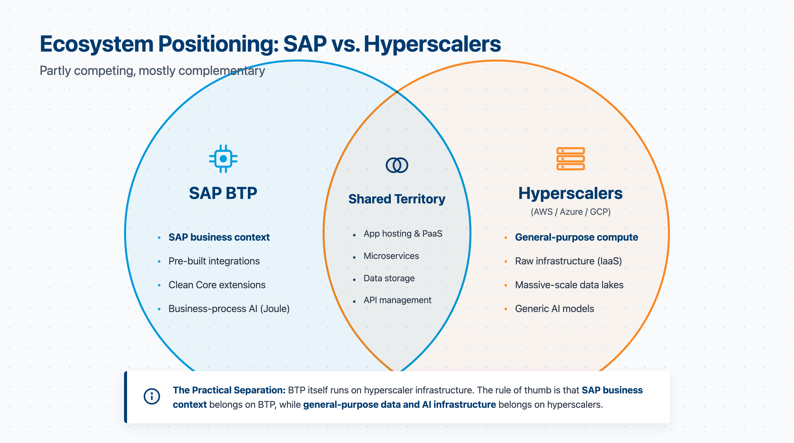

### Q3. Is there a free way to try BTP?

A: Yes. The Free Tier provides free access to selected services, and the Trial gives a time-limited evaluation environment.

### Q4. Where should I start learning?

A: The official [SAP Learning](https://learning.sap.com/learning-journeys/discover-sap-business-technology-platform) journey is the most structured. For hands-on, start with Build Apps or Integration Suite on the Free Tier.

---

## 11. References

- [SAP Help Portal: SAP Business Technology Platform](https://help.sap.com/docs/btp/sap-business-technology-platform/sap-business-technology-platform)
- [SAP Discovery Center](https://discovery-center.cloud.sap/) — Catalog of BTP services with pricing and roadmap
- [SAP Best Practices for S/4HANA](https://help.sap.com/docs/s4hana-best-practices/)
- [Explaining SAP BTP to a Beginner — SAP Community](https://community.sap.com/t5/technology-blog-posts-by-sap/explaining-sap-business-technology-platform-sap-btp-to-a-beginner-2025/ba-p/13557182)
